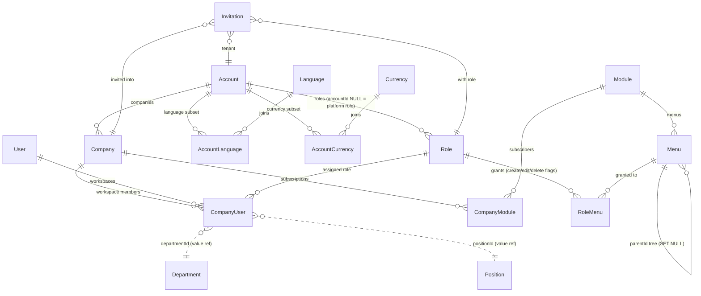
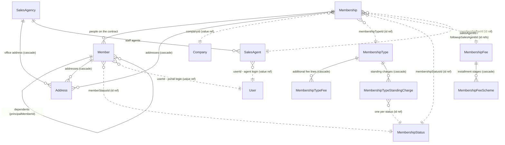
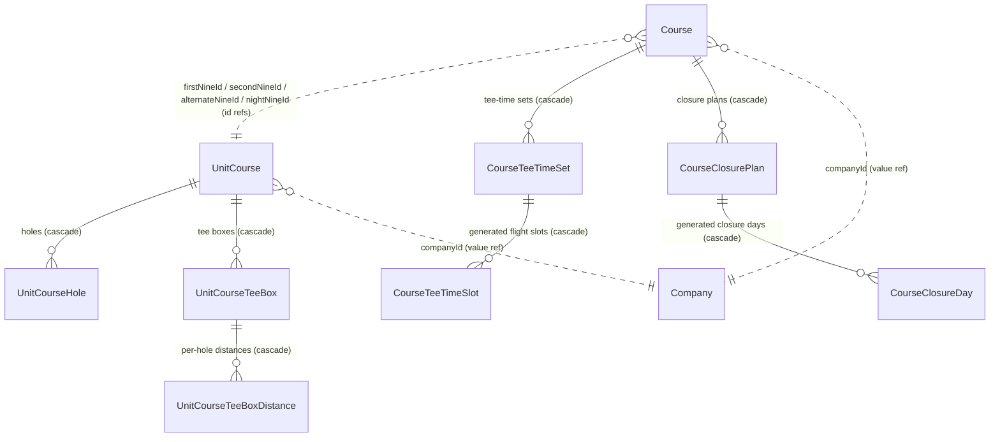
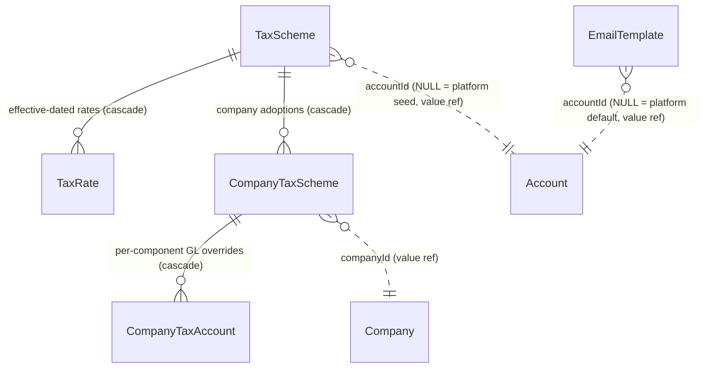

# Data Model

This doc is a curated map of the platform's database entities and relationships.
It is maintained by the `/data-model` skill - refresh it there, do not hand-edit it out of sync.
Sources of truth: `apps/api/src/wiring/associations.js` (all associations), the `*.model.js` files under `apps/api/src/modules/` (all columns), and `apps/api/src/platform/schemas.js` (physical schemas).
Business context and golden rules: `apps/api/docs/systems/`.
Last refreshed: 2026-07-22.

## Conventions

- **One owner per table.**
  A service is the single source of truth for its data; nobody else writes it or points a DB-level FK at it (golden rules in `apps/api/docs/systems/README.md`).
- **Cross-service references are plain UUID/value columns** - no Sequelize association, no DB FK.
  In the ERDs below these are drawn as dashed lines labelled `(value ref)`.
  Some intra-service references are also plain id columns validated in controllers (no association needed for eager-loading); those are dashed too, labelled `(id ref)`.
- **Real associations are intra-service FKs** - solid lines; `(cascade)` marks `onDelete: 'CASCADE'` header/detail pairs.
- **Postgres schemas**: each product/shared service owns its own schema - `membership`, `golf`, `tax` (`facility` reserved).
  Platform tier tables (identity, saas control plane, notification, outbox) stay in `public`.
- **Platform NULL-discriminator**: one table serves platform and subscribers; `accountId NULL` = the platform-owned row (`Role`, `EmailTemplate`, `TaxScheme`).
- **Money columns are `numeric(21,2)`**; percentages/rates keep their own precision (e.g. tax rate `DECIMAL(7,4)`).
- **RBAC record stamps**: product tables carry `createdBy` / `createdByDepartmentId` / `updatedBy` so the data-scope rules (own/department/all) can be enforced.

## Domain & schema map

| Module folder | Postgres schema | Service doc | Entities |
| --- | --- | --- | --- |
| `src/modules/identity` | `public` | [identity-auth.md](../apps/api/docs/systems/identity-auth.md) | User |
| `src/modules/saas` (Control Plane) | `public` | [system-administration.md](../apps/api/docs/systems/system-administration.md) | Account, Company, CompanyUser, Module, Menu, CompanyModule, Role, RoleMenu, Invitation, RegistrationLead, AccountLanguage, AccountCurrency. Standalone: Country, Currency, Language, IndustryType, Salutation, Nationality, Race, Title, PublicHoliday, CompanySmtpConfig, CompanyWeekendDay, NumberingScheme, UserFavorite, Department, Position, PlatformProfile (singleton) |
| `src/modules/notification` | `public` | [notification.md](../apps/api/docs/systems/notification.md) | Standalone: EmailTemplate |
| `src/platform` | `public` | [notification.md](../apps/api/docs/systems/notification.md) | Standalone: OutboxMessage (transactional outbox queue) |
| `src/modules/membership` | `membership` | [membership-management.md](../apps/api/docs/systems/membership-management.md) | Membership, Member, Address, MembershipStatus, MembershipFee, MembershipFeeScheme, MembershipType, MembershipTypeFee, MembershipTypeStandingCharge, SalesAgency, SalesAgent. Standalone: TransactionType, MembershipSetting (per-company singleton) |
| `src/modules/golf` | `golf` | [golf-management.md](../apps/api/docs/systems/golf-management.md) | UnitCourse, UnitCourseHole, UnitCourseTeeBox, UnitCourseTeeBoxDistance, Course, CourseTeeTimeSet, CourseTeeTimeSlot, CourseClosurePlan, CourseClosureDay. Standalone: TransactionType |
| `src/modules/tax` | `tax` | [tax.md](../apps/api/docs/systems/tax.md) | TaxScheme, TaxRate, CompanyTaxScheme, CompanyTaxAccount |
| `src/modules/facility` | `facility` (reserved) | [facility-management.md](../apps/api/docs/systems/facility-management.md) | none yet |

Standalone tables reference their owner (`accountId` / `companyId` / `userId`) by plain value and have no associations, so they are listed here but kept out of the ERDs.

## ERDs

### Control Plane & Identity

### Membership

Billing-item vocabulary (fee lines, standing charges) comes from the membership `TransactionType` master; rows reference it by id and resolve tax by code through the tax gateway seam.

### Golf

### Tax & platform services

`OutboxMessage` is the standalone transactional-outbox queue drained by the worker; it has no relationships.
Products consume tax through `platform/taxGateway.js` and numbering through `platform/numberingGateway.js` - seams, not associations.
