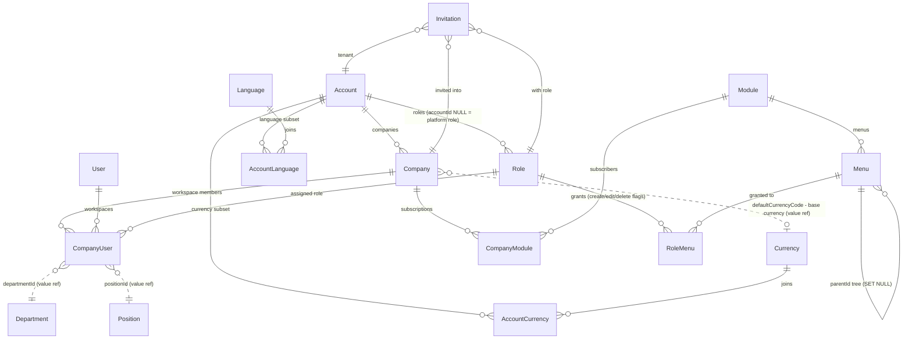
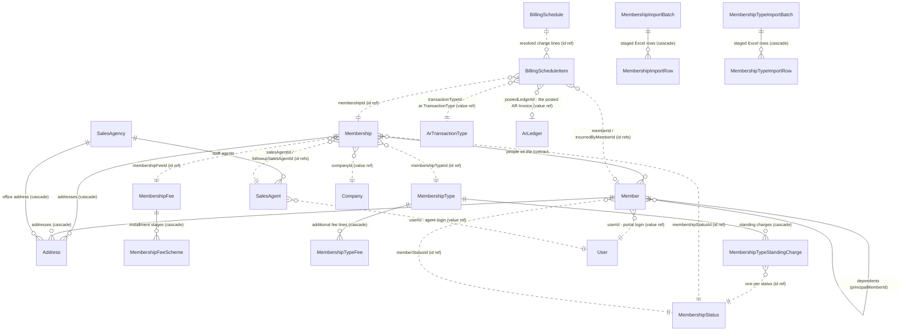
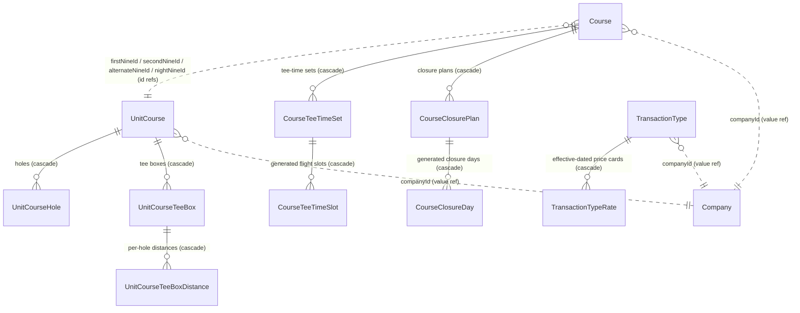
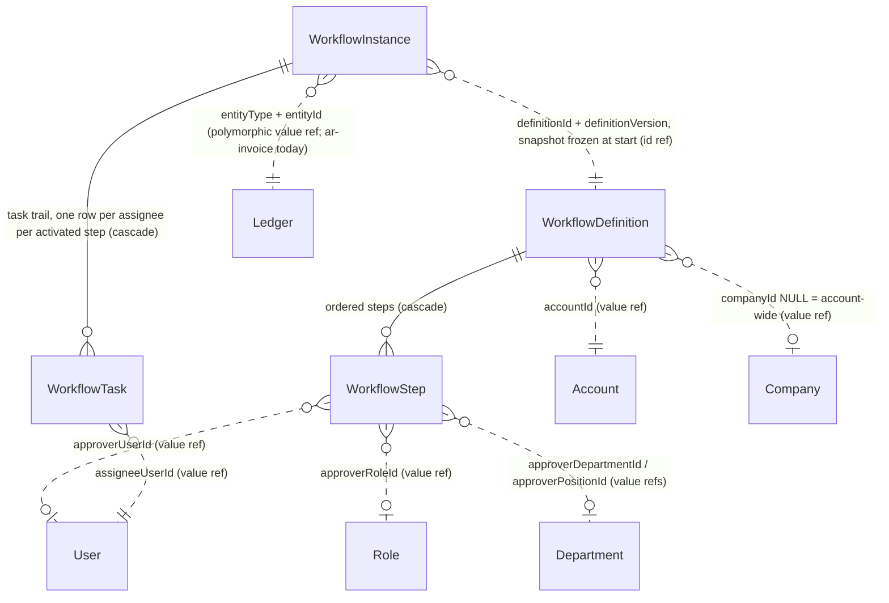
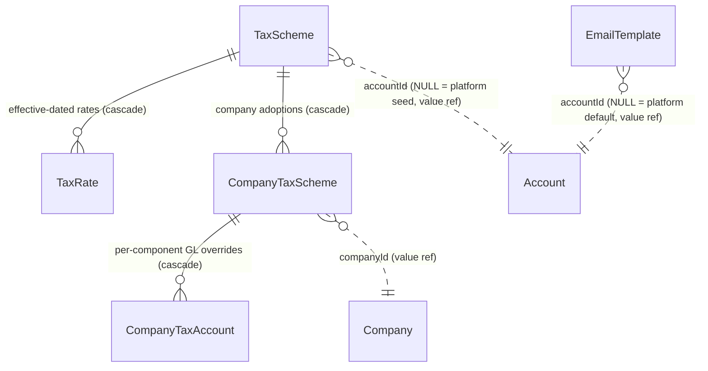

# Data Model

This doc is a curated map of the platform's database entities and relationships.
It is maintained by the `/data-model` skill - refresh it there, do not hand-edit it out of sync.
Sources of truth: `apps/api/src/wiring/associations.js` (all associations), the `*.model.js` files under `apps/api/src/modules/` and `apps/api/src/platform/` (all columns), and `apps/api/src/platform/schemas.js` (physical schemas).
Business context and golden rules: `apps/api/docs/systems/`.
Last refreshed: 2026-08-21.

## Conventions

- **One owner per table.**
  A service is the single source of truth for its data; nobody else writes it or points a DB-level FK at it (golden rules in `apps/api/docs/systems/README.md`).
- **Cross-service references are plain UUID/value columns** - no Sequelize association, no DB FK.
  In the ERDs below these are drawn as dashed lines labelled `(value ref)`.
  Some intra-service references are also plain id columns validated in the service (no association needed for eager-loading); those are dashed too, labelled `(id ref)`.
  Polymorphic references (a type column plus an id column, e.g. `Debtor.debtorType + sourceId`, `Allocation.creditDocType + creditDocId`) are always plain ids.
- **Real associations are intra-service FKs** - solid lines; `(cascade)` marks `onDelete: 'CASCADE'` header/detail pairs.
- **Postgres schemas**: each product/shared service owns its own schema - `membership`, `golf`, `tax`, `workflow`, `ar`, plus `audit` for the append-only trail (`facility` reserved).
  Platform tier tables (identity, saas control plane, notification, outbox) stay in `public`.
- **Platform NULL-discriminator**: one table serves platform and subscribers; `accountId NULL` = the platform-owned row (`Role`, `EmailTemplate`, `TaxScheme`).
  `WorkflowDefinition` deliberately has no platform row; its `companyId NULL` means account-wide instead.
- **Money columns are `numeric(21,2)`**; percentages/rates keep their own precision (tax rate `DECIMAL(7,4)`, interest rate `DECIMAL(7,4)`, exchange rate `DECIMAL(21,10)`).
- **RBAC record stamps**: product tables carry `createdBy` / `createdByDepartmentId` / `updatedBy` so the data-scope rules (own/department/all) can be enforced.
  `createdBy NULL` on a product row means system-generated (outbox provisioning, billing/interest run, void reversal).
- **Staged holding pattern**: long-running batch work (membership import, fee run, interest run, statement run) generates into a header + detail pair, is reviewed, then posts selectively.
  Partial unique indexes (`WHERE status <> 'cancelled'` / `<> 'void'`) are the month duplicate guards, so a cancelled run can be regenerated.
- **Snapshots over joins**: posted documents freeze what they used (tax scheme/rate, exchange rate, party name/address, aging boundaries) so history never rewrites when a master changes.

## Domain & schema map

| Module folder | Postgres schema | Service doc | Entities |
| --- | --- | --- | --- |
| `src/modules/identity` | `public` | [identity-auth.md](../apps/api/docs/systems/identity-auth.md) | User. Standalone: RefreshToken (session store), TrustedDevice (MFA skip) |
| `src/modules/saas` (Control Plane) | `public` | [system-administration.md](../apps/api/docs/systems/system-administration.md) | Account, Company, CompanyUser, Module, Menu, CompanyModule, Role, RoleMenu, Invitation, RegistrationLead, Language, Currency, AccountLanguage, AccountCurrency. Standalone: Country, IndustryType, Salutation, Nationality, Race, Title, PublicHoliday, CompanySmtpConfig, CompanyWeekendDay, UserFavorite, Department, Position, PlatformProfile (singleton), EInvoiceClassificationCode, EInvoiceMsicCode, EInvoiceTaxType, EInvoiceUnitType, EInvoiceStateCode, EInvoicePaymentMethod, EInvoiceDocumentType |
| `src/modules/notification` | `public` | [notification.md](../apps/api/docs/systems/notification.md) | Standalone: EmailTemplate, Notification (in-app bell) |
| `src/platform` | `public` | [notification.md](../apps/api/docs/systems/notification.md) | Standalone: OutboxMessage (transactional outbox queue) |
| `src/platform` | `audit` | - | Standalone: AuditLog (append-only, written only by the global hooks) |
| `src/modules/membership` | `membership` | [membership-management.md](../apps/api/docs/systems/membership-management.md) | Membership, Member, Address, MembershipFee, MembershipFeeScheme, MembershipType, MembershipTypeFee, MembershipTypeStandingCharge, SalesAgency, SalesAgent, MembershipImportBatch, MembershipImportRow, MembershipTypeImportBatch, MembershipTypeImportRow. Standalone: MembershipStatus, BillingSchedule, BillingScheduleItem, NumberingScheme, MembershipSetting (per-company singleton) |
| `src/modules/golf` | `golf` | [golf-management.md](../apps/api/docs/systems/golf-management.md) | UnitCourse, UnitCourseHole, UnitCourseTeeBox, UnitCourseTeeBoxDistance, Course, CourseTeeTimeSet, CourseTeeTimeSlot, CourseClosurePlan, CourseClosureDay, TransactionType, TransactionTypeRate |
| `src/modules/tax` | `tax` | [tax.md](../apps/api/docs/systems/tax.md) | TaxScheme, TaxRate, CompanyTaxScheme, CompanyTaxAccount |
| `src/modules/workflow` | `workflow` | - | WorkflowDefinition, WorkflowStep, WorkflowInstance, WorkflowTask |
| `src/modules/ar` (Account Receivable) | `ar` | [account-receivable.md](../apps/api/docs/systems/account-receivable.md) | All standalone (id refs validated in the service, no associations): TransactionType (the billing/receipting catalog, AR-owned since 2026-08-15), NumberingScheme, ExchangeRate (effective-dated FX rates vs the company base currency), Setting (per-company singleton), Debtor, OtherDebtor, CreditAccount, CreditMemberLimit, Ledger, Receipt, Deposit, Allocation, InterestGeneration, InterestGenerationDetail, Statement, StatementDetail, StatementRun |
| `src/modules/facility` | `facility` (reserved) | [facility-management.md](../apps/api/docs/systems/facility-management.md) | none yet |

Standalone tables reference their owner (`accountId` / `companyId` / `userId`) by plain value and have no associations.
Pure bookkeeping standalones (sessions, reference lists, settings, queues) are kept out of the ERDs; standalone document tables whose id refs carry the business meaning (AR, billing runs) are drawn with dashed lines.

Numbering Control is split per module: `membership.NumberingScheme` and `ar.NumberingScheme` share the `platform/numberingSchemeDef` shape, and the gapless counter lives beside the documents it numbers.
The old `public."NumberingScheme"` table is the already-copied migration source and stays until dropped manually.

Four models are not registered in `associations.js`: `TrustedDevice` (loaded by `trustedDevice.service.js`) and the two import staging pairs, whose batch/row association is declared inside the row model file and loaded by the import services/controllers.
They still sync with the rest of the models because they are required before boot sync completes _(confirm)_.

## ERDs

### Control Plane & Identity

```mermaid
erDiagram
    Account ||--o{ Company : "companies"
    Account ||--o{ Role : "roles (accountId NULL = platform role)"
    Account ||--o{ AccountLanguage : "language subset"
    Language ||--o{ AccountLanguage : "joins"
    Account ||--o{ AccountCurrency : "currency subset"
    Currency ||--o{ AccountCurrency : "joins"
    Company ||--o{ CompanyUser : "workspace members"
    User ||--o{ CompanyUser : "workspaces"
    Role ||--o{ CompanyUser : "assigned role"
    CompanyUser }o..|| Department : "departmentId (value ref)"
    CompanyUser }o..|| Position : "positionId (value ref)"
    Module ||--o{ Menu : "menus"
    Menu ||--o{ Menu : "parentId tree (SET NULL)"
    Company ||--o{ CompanyModule : "subscriptions"
    Module ||--o{ CompanyModule : "subscribers"
    Role ||--o{ RoleMenu : "grants (create/edit/delete flags)"
    Menu ||--o{ RoleMenu : "granted to"
    Invitation }o--|| Company : "invited into"
    Invitation }o--|| Account : "tenant"
    Invitation }o--|| Role : "with role"
    Company }o..o| Currency : "defaultCurrencyCode - base currency (value ref)"
```

`RefreshToken` and `TrustedDevice` hang off `User.userId` by value only (identity-service session store and MFA trusted browsers); `UserFavorite` and `Notification` hang off `userId + companyId` the same way.

### Membership

```mermaid
erDiagram
    Membership ||--o{ Member : "people on the contract"
    Member ||--o{ Member : "dependents (principalMemberId)"
    Membership ||--o{ Address : "addresses (cascade)"
    Member ||--o{ Address : "addresses (cascade)"
    SalesAgency ||--o{ Address : "office address (cascade)"
    SalesAgency ||--o{ SalesAgent : "staff agents"
    MembershipFee ||--o{ MembershipFeeScheme : "installment stages (cascade)"
    MembershipType ||--o{ MembershipTypeFee : "additional fee lines (cascade)"
    MembershipType ||--o{ MembershipTypeStandingCharge : "standing charges (cascade)"
    MembershipTypeStandingCharge }o..|| MembershipStatus : "one per status (id ref)"
    Membership }o..|| Company : "companyId (value ref)"
    Membership }o..|| MembershipType : "membershipTypeId (id ref)"
    Membership }o..|| MembershipStatus : "membershipStatusId (id ref)"
    Membership }o..|| MembershipFee : "membershipFeeId (id ref)"
    Membership }o..|| SalesAgent : "salesAgentId / followupSalesAgentId (id refs)"
    Member }o..|| MembershipStatus : "memberStatusId (id ref)"
    Member }o..|| User : "userId - portal login (value ref)"
    SalesAgent }o..|| User : "userId - agent login (value ref)"
    BillingSchedule ||..o{ BillingScheduleItem : "resolved charge lines (id ref)"
    BillingScheduleItem }o..|| Membership : "membershipId (id ref)"
    BillingScheduleItem }o..o| Member : "memberId / incurredByMemberId (id refs)"
    BillingScheduleItem }o..|| ArTransactionType : "transactionTypeId - ar.TransactionType (value ref)"
    BillingScheduleItem }o..o| ArLedger : "postedLedgerId - the posted AR Invoice (value ref)"
    MembershipImportBatch ||--o{ MembershipImportRow : "staged Excel rows (cascade)"
    MembershipTypeImportBatch ||--o{ MembershipTypeImportRow : "staged Excel rows (cascade)"
```

Billing-item vocabulary (fee lines, standing charges, fee-run items) comes from the AR-owned `ar.TransactionType` catalog since 2026-08-15; rows reference it by id and resolve tax by code through the tax gateway seam.
The fee run (`BillingSchedule` + items) is the producer-side holding table: each posted item becomes exactly one AR Invoice through `platform/arGateway.js`.
Import staging rows keep every parsed column in JSONB (`data`) and lift only the linking keys into real columns; `migratedId` points at the real row a staged row became.

### Golf

```mermaid
erDiagram
    UnitCourse ||--o{ UnitCourseHole : "holes (cascade)"
    UnitCourse ||--o{ UnitCourseTeeBox : "tee boxes (cascade)"
    UnitCourseTeeBox ||--o{ UnitCourseTeeBoxDistance : "per-hole distances (cascade)"
    Course }o..|| UnitCourse : "firstNineId / secondNineId / alternateNineId / nightNineId (id refs)"
    Course ||--o{ CourseTeeTimeSet : "tee-time sets (cascade)"
    CourseTeeTimeSet ||--o{ CourseTeeTimeSlot : "generated flight slots (cascade)"
    Course ||--o{ CourseClosurePlan : "closure plans (cascade)"
    CourseClosurePlan ||--o{ CourseClosureDay : "generated closure days (cascade)"
    TransactionType ||--o{ TransactionTypeRate : "effective-dated price cards (cascade)"
    Course }o..|| Company : "companyId (value ref)"
    UnitCourse }o..|| Company : "companyId (value ref)"
    TransactionType }o..|| Company : "companyId (value ref)"
```

The golf `TransactionType` is the golf billing-item master (tax by code via the seam); it is a different table from `ar.TransactionType`.

### Account Receivable

```mermaid
erDiagram
    Debtor }o..|| Company : "companyId (value ref)"
    Debtor }o..|| Membership : "debtorType 'membership' + sourceId (value ref)"
    Debtor }o..|| Member : "debtorType 'member' + sourceId (value ref)"
    Debtor }o..|| OtherDebtor : "debtorType 'other' + sourceId (id ref)"
    Debtor ||..|| CreditAccount : "shared credit pool (id ref, unique debtorId)"
    Debtor ||..o{ CreditMemberLimit : "per-person caps (id ref)"
    CreditMemberLimit }o..|| Member : "memberId (value ref)"
    Debtor ||..o{ Ledger : "invoice / debit-note / credit-note (id ref)"
    Debtor ||..o{ Receipt : "receipt / refund (id ref)"
    Debtor ||..o{ Deposit : "security deposits (id ref)"
    Ledger }o..|| TransactionType : "transactionTypeId - tax snapshotted at posting (id ref)"
    Receipt }o..o| TransactionType : "transactionTypeId - receipt class (id ref)"
    Ledger }o..o| Ledger : "reversalOfId / applyToLedgerId (id refs)"
    Ledger }o..o| Member : "incurredByMemberId (value ref)"
    Ledger }o..o| WorkflowInstance : "workflowInstanceId (value ref)"
    Allocation }o..|| Ledger : "credit or debit side 'ledger' (polymorphic id ref)"
    Allocation }o..|| Receipt : "'receipt' / 'refund' side (polymorphic id ref)"
    Allocation }o..|| Deposit : "'deposit' side (polymorphic id ref)"
    InterestGeneration }o..|| Debtor : "debtorId, one per month (id ref)"
    InterestGeneration ||..o{ InterestGenerationDetail : "overdue lines (id ref)"
    InterestGenerationDetail }o..|| Ledger : "chargeId - the overdue debit (id ref)"
    InterestGeneration }o..o| Ledger : "postedLedgerId - summary Debit Note (id ref)"
    Statement }o..|| Debtor : "debtorId, one live per month (id ref)"
    Statement ||..o{ StatementDetail : "frozen lines with running balance (id ref)"
    StatementDetail }o..|| Ledger : "docType + docId (polymorphic id ref)"
    Setting }o..o| TransactionType : "interest / depositConversion / fxGain / fxLoss type ids (id refs)"
    ExchangeRate }o..|| Company : "companyId (value ref)"
    ExchangeRate }o..|| Currency : "currencyCode - foreign currency (value ref)"
```

`Debtor` is the thin ledger account: the pointer runs one way (`debtorType + sourceId`), Membership/Member never carry a debtorId, and `debtorAccount` / `name` are sort-key snapshots only.
Hot balances are materialized on `CreditAccount.outstanding` and `CreditMemberLimit.personalUsed` (fixed lock order: pool row, then person rows) and asserted by reconciliation against `Allocation` rows.
Valid allocation pairs are `receipt -> ledger`, `ledger(credit) -> ledger(debit)`, `receipt -> deposit`, `deposit -> refund`, `receipt -> refund`; there is deliberately no `deposit -> ledger` pair (that is the conversion process, which posts a Credit Note).
`Ledger` and `Receipt` carry the draft lifecycle (`draft` / `pending-approval` / `open` / `settled` / `void`) with posting and void audit columns; receipts post directly (no approval chain).
`StatementRun` is the worker-driven job row (lease + progress counters) and has no business relationships, so it stays out of the diagram.
`ExchangeRate` (added 2026-08-21, step 1 of multicurrency AR) holds one rate per foreign currency per effective day; `rate` is how many base-currency units one foreign unit buys, looked up as the latest `effectiveDate <= docDate`.
Documents will snapshot the rate they used in later steps, so editing a rate only changes future defaults.
`Setting.multiCurrencyEnabled` gates foreign-currency Other Debtor accounts (currency per account, never per document); `fxGainTransactionTypeId` / `fxLossTransactionTypeId` designate the Forex-class catalog entries realized gain/loss posts under.

### Workflow

```mermaid
erDiagram
    WorkflowDefinition ||--o{ WorkflowStep : "ordered steps (cascade)"
    WorkflowInstance ||--o{ WorkflowTask : "task trail, one row per assignee per activated step (cascade)"
    WorkflowInstance }o..|| WorkflowDefinition : "definitionId + definitionVersion, snapshot frozen at start (id ref)"
    WorkflowDefinition }o..|| Account : "accountId (value ref)"
    WorkflowDefinition }o..o| Company : "companyId NULL = account-wide (value ref)"
    WorkflowStep }o..o| Role : "approverRoleId (value ref)"
    WorkflowStep }o..o| Department : "approverDepartmentId / approverPositionId (value refs)"
    WorkflowStep }o..o| User : "approverUserId (value ref)"
    WorkflowTask }o..|| User : "assigneeUserId (value ref)"
    WorkflowInstance }o..|| Ledger : "entityType + entityId (polymorphic value ref; ar-invoice today)"
```

One definition per purpose per scope; routing variations live in step `condition` JSON, not in competing definitions.
The DB guarantees one live instance per document (partial unique on `entityType + entityId WHERE status = 'in-progress'`).
Products submit through `platform/workflowGateway.js`; the first wired producer is the AR invoice (approve auto-posts).

### Tax & platform services

```mermaid
erDiagram
    TaxScheme ||--o{ TaxRate : "effective-dated rates (cascade)"
    TaxScheme ||--o{ CompanyTaxScheme : "company adoptions (cascade)"
    CompanyTaxScheme ||--o{ CompanyTaxAccount : "per-component GL overrides (cascade)"
    CompanyTaxScheme }o..|| Company : "companyId (value ref)"
    TaxScheme }o..|| Account : "accountId (NULL = platform seed, value ref)"
    EmailTemplate }o..|| Account : "accountId (NULL = platform default, value ref)"
```

`OutboxMessage` is the standalone transactional-outbox queue drained by the worker; it has no relationships.
`AuditLog` (schema `audit`) is append-only and keyed by `tableName + recordId`; `userEmail` is denormalized so the trail outlives the user row, and `requestId` groups every row one HTTP request changed.
Products consume tax through `platform/taxGateway.js`, numbering through `platform/numberingGateway.js`, AR posting through `platform/arGateway.js`, and approvals through `platform/workflowGateway.js` - seams, not associations.
